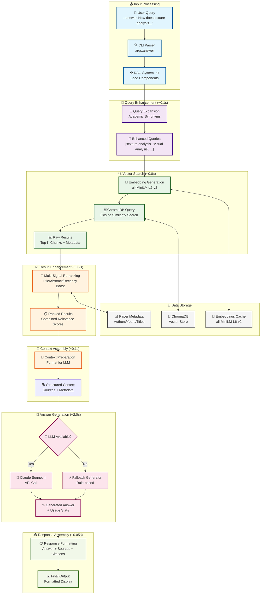

# 🤖 Research Paper RAG System

A sophisticated Retrieval-Augmented Generation (RAG) system specifically designed for academic research papers. This system combines semantic search, advanced metadata extraction, and state-of-the-art language models to provide intelligent, well-sourced answers to research questions.

[](https://python.org)
[](https://chromadb.ai)
[](https://anthropic.com)
[](https://opensource.org/licenses/MIT)

## 🎯 Features

- **🔍 Intelligent PDF Processing**: Extract and clean text from research papers with metadata detection
- **📊 Advanced Metadata Extraction**: Automatically extract titles, authors, publication years, and citations
- **🗄️ Vector Database Storage**: ChromaDB-powered semantic search with embedding caching
- **🤖 LLM Integration**: Claude Sonnet 4 integration with fallback mechanisms
- **🎯 Smart Query Expansion**: Academic term synonyms and query enhancement
- **📈 Result Re-ranking**: Multi-signal relevance scoring for better results
- **📚 Source Attribution**: Proper academic citations and source tracking
- **⚡ Fast Performance**: ~3-5 second response times with caching

## 🏗️ System Architecture



## 🚀 Quick Start

### Prerequisites

- Python 3.9+
- 4GB+ RAM (8GB recommended)
- Internet connection for LLM API calls

### Installation

1. **Clone the repository**
```bash
git clone <repository-url>
cd research-paper-rag-system
```

2. **Create virtual environment**
```bash
python -m venv venv
source venv/bin/activate  # On Windows: venv\Scripts\activate
```

3. **Install dependencies**
```bash
pip install -r requirements.txt
```

4. **Set up environment variables**
```bash
cp .env.example .env
# Edit .env and add your API keys:
# ANTHROPIC_API_KEY=sk-ant-api03-your-key-here
# OPENAI_API_KEY=sk-your-openai-key-here  # Optional
```

### Basic Usage

1. **Add research papers to the system**
```bash
# Add a single PDF
python research_paper_rag.py --add path/to/paper.pdf

# Batch process a directory
python research_paper_rag.py --batch path/to/pdfs/
```

2. **Search for relevant content**
```bash
# Basic search
python research_paper_rag.py --search "neural networks computer vision"

# Get more results
python research_paper_rag.py --search "attention mechanism" --results 10
```

3. **Ask questions and get comprehensive answers**
```bash
# Basic question answering
python research_paper_rag.py --answer "How do transformers compare to CNNs?"

# Specify LLM provider
python research_paper_rag.py --answer "What is attention mechanism?" --llm anthropic

# Get more context
python research_paper_rag.py --answer "Latest advances in computer vision" --results 15
```

4. **Manage your database**
```bash
# List all papers
python research_paper_rag.py --list

# Show database statistics
python research_paper_rag.py --stats
```

## 📋 Detailed Usage Examples

### Question Answering with Citations

```bash
python research_paper_rag.py --answer "How does texture analysis compare brain visual systems with CNNs?"
```

**Sample Output:**
```
🤖 **Answer** (Confidence: 87.3%, Model: anthropic (claude-sonnet-4-20250514)):

Texture analysis serves as a crucial bridge for comparing brain visual systems with CNNs through several key mechanisms:

## Hierarchical Feature Processing
Both the brain's visual cortex and CNNs process texture information hierarchically. In area V1, basic texture features like edges and orientations are extracted, while V2 combines these into more complex patterns...

📚 **Sources** (3 papers used):

[1] Correspondence of Deep Neural Networks and the Brain for Visual Textures (2018)
    Authors: Md Nasir Uddin Laskar, Luis G Sanchez Giraldo, Odelia Schwartz
    Relevance: 0.924 (title match, abstract match)
    Citation: Laskar et al. (2018) Correspondence of Deep Neural Networks...

🔧 **LLM Usage:**
    Input tokens: 1,247
    Output tokens: 394

📊 Used 5 context chunks for this answer.
```

### Advanced Search with Filters

```python
from research_paper_rag import ResearchPaperRAG

# Initialize system
rag = ResearchPaperRAG(llm_provider="anthropic")

# Search with filters
results = rag.search(
    query="deep learning computer vision",
    n_results=10,
    year_filter=2020,  # Only papers from 2020
    author_filter="Smith",  # Papers by authors with "Smith"
    use_query_expansion=True,
    use_reranking=True
)

# Get detailed paper information
paper_details = rag.get_paper_details("Attention Is All You Need")
```

## 📁 Project Structure

```
research-paper-rag-system/
├── research_paper_rag.py          # Main RAG system implementation
├── pdf_embedding_processor.py     # PDF processing and embeddings
├── metadata_extractor.py          # Academic metadata extraction
├── vector_database.py             # ChromaDB integration
├── llm_integration.py             # LLM provider management
├── enhanced_chunking.py           # Advanced text chunking strategies
├── requirements.txt               # Python dependencies
├── .env.example                   # Environment variables template
├── README.md                      # This file
├── pdfs/                          # Directory for PDF files
├── research_papers_db/            # ChromaDB storage (auto-created)
└── configs/                       # Configuration files
```


## 🧠 Core Components

### 1. PDF Processing (`pdf_embedding_processor.py`)
- **Text Extraction**: PyMuPDF-based PDF text extraction
- **Text Cleaning**: Remove headers, footers, and formatting artifacts
- **Sentence-Aware Chunking**: Intelligent text segmentation
- **Embedding Generation**: all-MiniLM-L6-v2 sentence transformers

### 2. Metadata Extraction (`metadata_extractor.py`)
- **Title Detection**: Multi-line title pattern matching
- **Author Parsing**: Support for multiple author formats
- **Year Extraction**: arXiv and publication date parsing
- **Abstract Detection**: Automatic abstract identification
- **Citation Formatting**: APA-style citation generation

### 3. Vector Database (`vector_database.py`)
- **ChromaDB Integration**: Persistent vector storage
- **Semantic Search**: Cosine similarity-based retrieval
- **Metadata Filtering**: Filter by year, author, etc.
- **Duplicate Detection**: DOI and title-based deduplication

### 4. LLM Integration (`llm_integration.py`)
- **Multi-Provider Support**: Anthropic Claude, OpenAI GPT
- **Structured Prompting**: Academic-focused prompt engineering
- **Error Handling**: Automatic fallback to rule-based generation
- **Usage Tracking**: Token counting and cost estimation

### 5. Query Enhancement
- **Academic Synonyms**: 50+ term mappings for research domains
- **Query Expansion**: Automatic query variation generation
- **Result Re-ranking**: Multi-signal relevance scoring
- **Context Assembly**: Structured context preparation for LLMs


## 🔍 API Reference

### Main RAG Class

```python
class ResearchPaperRAG:
    def __init__(self, db_path="./research_papers_db", 
                 embedding_model="all-MiniLM-L6-v2", 
                 llm_provider="anthropic", **llm_kwargs)
    
    def add_paper_from_pdf(self, pdf_path, chunk_size=512, 
                          overlap=50, force_reprocess=False) -> Dict
    
    def search(self, query, n_results=3, year_filter=None, 
              author_filter=None, use_query_expansion=True, 
              use_reranking=True) -> List[Dict]
    
    def answer_question(self, question, n_results=5, 
                       include_sources=True) -> Dict
    
    def list_papers(self, limit=50) -> List[Dict]
    
    def get_stats(self) -> Dict
    
    def batch_process_directory(self, directory_path, 
                               file_pattern="*.pdf", 
                               max_files=None) -> Dict
```

### CLI Commands

```bash
# Paper management
python research_paper_rag.py --add <pdf_path>
python research_paper_rag.py --batch <directory_path>
python research_paper_rag.py --list
python research_paper_rag.py --stats

# Search and query
python research_paper_rag.py --search "<query>" [--results N]
python research_paper_rag.py --answer "<question>" [--results N] [--llm provider]

# Options
--results N          # Number of results (default: 3 for search, 5 for answers)
--llm PROVIDER       # LLM provider: anthropic, openai, fallback, none
```

## 🔄 Workflow Examples

### Academic Research Workflow

```bash
# 1. Set up your research corpus
python research_paper_rag.py --batch ./papers/computer_vision/

# 2. Explore the literature
python research_paper_rag.py --search "attention mechanism transformers"

# 3. Get comprehensive answers
python research_paper_rag.py --answer "How do attention mechanisms improve computer vision models?"

# 4. Check database status
python research_paper_rag.py --stats
```

### Literature Review Workflow

```python
# Initialize system
rag = ResearchPaperRAG()

# Add papers from your collection
batch_result = rag.batch_process_directory("./literature_review_papers/")

# Generate answers for key research questions
questions = [
    "What are the main approaches to neural architecture search?",
    "How has transformer architecture evolved for computer vision?",
    "What are the latest developments in self-supervised learning?"
]

for question in questions:
    result = rag.answer_question(question, n_results=10)
    print(f"Question: {question}")
    print(f"Answer: {result['answer']}")
    print(f"Sources: {len(result['sources'])} papers")
    print("-" * 80)
```


## 📄 Dependencies

### Core Dependencies
```txt
chromadb>=0.4.0
sentence-transformers>=2.2.0
anthropic>=0.68.0
python-dotenv>=1.0.0
PyMuPDF>=1.23.0
nltk>=3.8.0
pandas>=2.0.0
numpy>=1.24.0
```

### Optional Dependencies
```txt
openai>=1.0.0          # For OpenAI integration
faiss-cpu>=1.7.4       # For faster similarity search
matplotlib>=3.7.0      # For visualization
jupyter>=1.0.0         # For notebooks
```

Install all dependencies:
```bash
pip install -r requirements.txt
```

## 🚨 Troubleshooting

### Common Issues

**1. ChromaDB Connection Error**
```bash
# Solution: Remove corrupted database
rm -rf research_papers_db/
# Re-run your commands to recreate
```

**2. NLTK Data Missing**
```python
import nltk
nltk.download('punkt')
nltk.download('punkt_tab')
```

**3. Out of Memory**
```bash
# Reduce chunk size and batch size
python research_paper_rag.py --add paper.pdf --chunk-size 256
```

**4. API Rate Limits**
```python
# Use fallback generation
rag = ResearchPaperRAG(llm_provider="fallback")
```

**5. Slow Performance**
```bash
# Enable GPU acceleration (if available)
pip install sentence-transformers[torch-gpu]
```

### Debug Mode

```bash
# Enable detailed logging
export PYTHONPATH="."
python -c "
import logging
logging.basicConfig(level=logging.DEBUG)
from research_paper_rag import ResearchPaperRAG
rag = ResearchPaperRAG()
result = rag.answer_question('test')
"
```

## 📈 Roadmap

### Upcoming Features

- [ ] **Multi-modal Support**: Images, tables, and figures
- [ ] **Advanced Chunking**: Section-aware and semantic chunking
- [ ] **Graph RAG**: Knowledge graph integration
- [ ] **Collaborative Filtering**: User preference learning
- [ ] **Real-time Updates**: Live paper ingestion from arXiv
- [ ] **Web Interface**: Streamlit/Gradio UI
- [ ] **API Server**: REST API for integration
- [ ] **Cloud Deployment**: Docker containerization

### Performance Improvements

- [ ] **Caching System**: Redis-based result caching
- [ ] **Parallel Processing**: Multi-threaded PDF processing
- [ ] **GPU Acceleration**: FAISS GPU index support
- [ ] **Streaming Responses**: Real-time answer generation
- [ ] **Batch Optimization**: Optimized batch embedding generation
